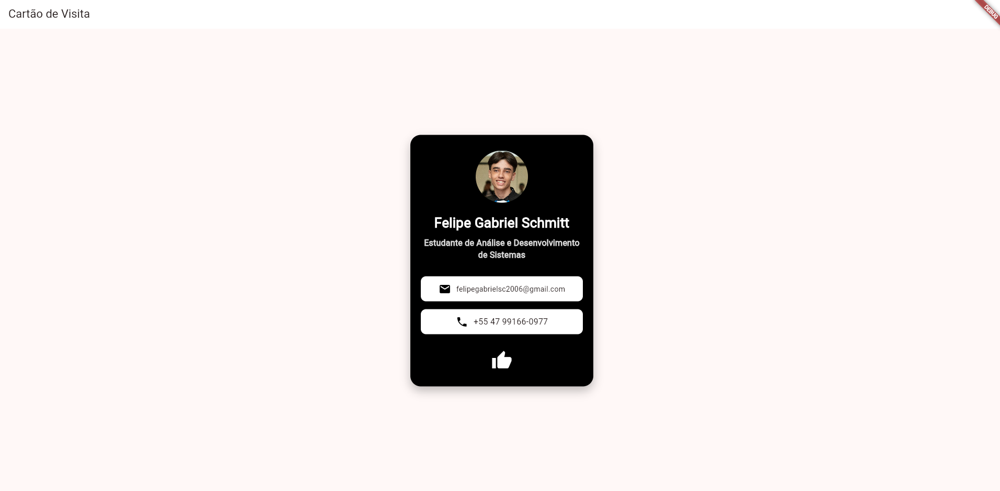

# Cartão de Visita Digital em Flutter

## Sobre o Projeto
Este é o meu primeiro aplicativo em Flutter, desenvolvido como requisito da Atividade Prática da disciplina Desenvolvimento para Dispositivos Móveis. O objetivo do projeto é criar um cartão de visita digital personalizado, aplicando na prática os conceitos de widgets básicos (Text, Container, Column, Row), layouts e estilização. 

## Informações do Aluno
* **Nome:** Felipe Gabriel Schmitt
* **Curso:** Análise e Desenvolvimento de Sistemas - 5ª Fase
* **Instituição:** Faculdade Senac Joinville
* **Disciplina:** Desenvolvimento para Dispositivos Móveis

## Screenshot

## Como rodar o projeto
Para executar este aplicativo na sua máquina, siga os passos abaixo:

1. Certifique-se de ter o Flutter SDK e o Git instalados no seu computador.
2. Clone este repositório usando o comando: `git clone https://github.com/SEU_USUARIO/cartao-visita-flutter-FelipeGabriel.git`
3. Abra a pasta do projeto no seu editor de código (VS Code ou Android Studio).
4. Conecte um emulador ou dispositivo físico e rode o aplicativo com o comando: `flutter run`.
